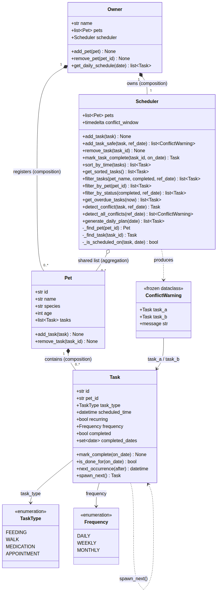

# PawPal+ — Smart Pet Care Scheduler

> **CodePath AI110 · Module 2 Project** — Built by Princewill Nwokeke

**PawPal+** is a Streamlit app that helps a busy pet owner plan and track daily care tasks
for one or more pets. The app supports multiple pets, recurring tasks, automatic conflict
detection, and priority-aware daily plans. All scheduling intelligence lives in
`pawpal_system.py` — the Streamlit UI in `app.py` is a thin layer that calls those classes
directly, so the logic can be tested and used independently of the browser.

---

## System Architecture (UML)



> Source: [`diagrams/uml_final.mmd`](diagrams/uml_final.mmd)
> Regenerate the PNG any time with:
> ```bash
> npx @mermaid-js/mermaid-cli -i diagrams/uml_final.mmd -o diagrams/uml_final.png
> ```

---

## Features

### 1. Chronological Sorting with Priority Tiebreaker
`Scheduler.get_sorted_tasks()` sorts every task by `(scheduled_time, TASK_PRIORITY[task_type])`.
When two tasks share the same slot, the one with higher medical urgency surfaces first:

| Rank | Task type | Reasoning |
|------|-----------|-----------|
| 1 | MEDICATION | Health impact if missed |
| 2 | APPOINTMENT | External party is waiting |
| 3 | FEEDING | Consistent but flexible by minutes |
| 4 | WALK | Most adjustable in timing |

`sort_by_time()` uses a zero-padded `"HH:MM"` string key — lexicographic order is identical
to chronological order, so no numeric conversion is needed.

### 2. Lightweight Conflict Detection
`Scheduler.add_task_safe(task)` **always** registers the task and returns a
`list[ConflictWarning]` for every active task within the 15-minute `conflict_window`.
The program never crashes or blocks — warnings are returned as data; the caller decides
what to do. The Streamlit UI displays them in a side-by-side card with a plain-English
gap ("8 min apart") and a resolution tip.

`Scheduler.detect_all_conflicts()` scans **every** active task pair — same-pet and
cross-pet — because the owner physically attends every task. The inner loop breaks early
on sorted input: once gap ≥ window, no later task can conflict, making each step O(k)
where k ≈ tasks-per-slot.

### 3. Daily and Weekly Recurring Tasks
`Task.spawn_next()` creates the next occurrence using `timedelta`:
- `DAILY → scheduled_time + timedelta(days=1)`
- `WEEKLY → scheduled_time + timedelta(weeks=1)`

`Scheduler.mark_task_complete(task_id)` orchestrates four steps:
1. Call `spawn_next()` to build the next Task.
2. Call `mark_complete()` on the original.
3. Set `recurring=False` and `completed=True` on the original (retire it from future plans).
4. Register the new instance via `add_task()`.

A lineage ID tracks the chain: `"feed_buddy"` → `"feed_buddy#2"` → `"feed_buddy#3"`.

### 4. Per-Date Completion Semantics
`Task.is_done_for(on_date)` checks `completed_dates: set[date]` for recurring tasks,
not the permanent `completed` boolean. A daily feeding marked done on Monday shows as
pending again on Tuesday — without creating a new object.

### 5. Smart Filtering
`Scheduler.filter_tasks(pet_name, completed, reference_date)` ANDs any combination of
filters and returns results sorted by time. Specialised variants include:
- `filter_by_pet(pet_id)` — all tasks for one pet
- `filter_by_status(completed, reference_date)` — pending or done on a specific date
- `get_overdue_tasks(now)` — non-recurring tasks past their due time (recurring tasks
  are excluded — they auto-spawn instead of going overdue)

### 6. Daily Plan Generation with Start-Date Guard
`Scheduler.generate_daily_plan(date)` collects tasks whose `_is_scheduled_on(task, date)`
returns `True`. A spawned task due tomorrow is blocked by the start-date guard
(`if date < task.scheduled_time.date(): return False`), preventing it from leaking
into today's plan.

---

## Getting Started

```bash
python -m venv .venv
source .venv/bin/activate        # Windows: .venv\Scripts\activate
pip install -r requirements.txt
```

**Run the Streamlit app:**

```bash
streamlit run app.py
```

**Run the CLI conflict-detection demo:**

```bash
python main.py
```

**Run the test suite:**

```bash
pytest tests/test_pawpal.py -v   # verbose, one line per test
pytest --cov                     # with coverage report
```

---

## 📸 Demo Walkthrough

### What a user can do in the Streamlit app

The app is divided into seven steps, each wiring directly to a backend method:

| Step | UI action | Method called |
|------|-----------|---------------|
| 1 | Enter a name and click **Create Owner** | `Owner(name)` |
| 2 | Fill in pet details and click **Add Pet** | `owner.add_pet(pet)` |
| 3 | Choose task type, time, recurrence → **Add Task** | `scheduler.add_task_safe(task)` |
| 4 | Click **Generate Schedule** | `owner.get_daily_schedule(date)` |
| 5 | Click **Run Full Conflict Scan** | `scheduler.detect_all_conflicts()` |
| 6 | Choose pet / status filters | `scheduler.filter_tasks(...)` |
| 7 | Select a pending task → **Mark Complete** | `scheduler.mark_task_complete(id)` |

### Example workflow

1. **Create owner** — enter "Alice" → click **Create Owner**.
   `Owner.__init__` wires a `Scheduler` automatically; they share the same `pets` list.

2. **Add two pets** — add Buddy (Golden Retriever, age 3) then Whiskers (Persian Cat, age 5).
   The pet roster table updates live on every rerun.

3. **Schedule tasks** — add a WALK for Buddy at 09:00 AM (no conflicts, green success banner).
   Then add a FEEDING for Buddy at 09:00 AM — `add_task_safe()` registers it and returns
   one `ConflictWarning`. The UI shows a yellow `st.warning` card with two columns:

   ```
   ⚠️ Conflict detected (same pet · exact same time)
   The task was added, but it overlaps with an existing booking:

   New task           ↔    Existing task
   🐾 Buddy                🐾 Buddy
   📋 FEEDING              📋 WALK
   🕐 09:00 AM             🕐 09:00 AM

   💡 Tip: Adjust one task by at least 15 minutes to clear this conflict.
   ```

4. **Generate today's schedule** — click **Generate Schedule**.
   Three `st.metric` tiles show Total / Completed / Remaining.
   The `st.dataframe` table lists tasks in chronological order; same-time tasks appear
   in priority order (MEDICATION before WALK).

5. **Run conflict scan** — click **Run Full Conflict Scan**.
   `detect_all_conflicts()` returns every clashing pair. Each conflict opens in its own
   `st.expander` with scope ("Same pet" or "Cross-pet"), gap in plain English, and a
   resolution tip.

6. **Filter** — select "Buddy" + "Pending" to see only Buddy's unfinished tasks.

7. **Mark complete** — select "WALK — Buddy @ 09:00 AM" and click **Mark Complete**.
   For a daily recurring task the success banner shows the auto-spawned next occurrence:
   ```
   ✅ Task marked complete.
   Next occurrence auto-scheduled: WALK on Saturday, July 04 at 09:00 AM (ID: walk_buddy#2)
   ```

### Key Scheduler behaviors shown

- **Sorting** — tasks are always returned earliest-first; MEDICATION beats WALK at 09:00 AM.
- **Conflict warnings** — adding a task within 15 minutes of any existing one (same pet or
  different pet) produces a `ConflictWarning`; the task is never blocked, only flagged.
- **Recurring chain** — completing a daily task retires the original and spawns a +1-day
  successor with an incrementing ID (`#2`, `#3`, …).
- **Per-date completion** — the same recurring task shows as done today and pending tomorrow
  without needing a new object each day.

---

### CLI output — `python main.py`

```
================================================================
  PawPal+ — Lightweight Conflict Detection
================================================================
  Owner : Alice
  Pets  : Buddy (Golden Retriever)  |  Whiskers (Persian Cat)
  Conflict window : 15 minutes

  SETUP — anchor task, no conflicts yet
  ────────────────────────────────────────────────────────────────
    Added: walk_buddy  (Buddy, WALK @ 09:00 AM)
    ✓  No conflicts — schedule is clear.

  DEMO 1 — same pet, exact same time
  ────────────────────────────────────────────────────────────────
    Adding: feed_buddy  (Buddy, FEEDING @ 09:00 AM)

    ⚠  CONFLICT (same pet, same time)  'feed_buddy' feeding @ 09:00 AM  ↔  'walk_buddy' walk @ 09:00 AM

  DEMO 2 — different pets, exact same time
  ────────────────────────────────────────────────────────────────
    Adding: med_whiskers  (Whiskers, MEDICATION @ 09:00 AM)

    ⚠  CONFLICT (different pets, same time)  'med_whiskers' medication @ 09:00 AM  ↔  'feed_buddy' feeding @ 09:00 AM
    ⚠  CONFLICT (different pets, same time)  'med_whiskers' medication @ 09:00 AM  ↔  'walk_buddy' walk @ 09:00 AM

  DEMO 3 — same pet, 8 min apart  (within 15-min window)
  ────────────────────────────────────────────────────────────────
    Adding: appt_buddy  (Buddy, APPOINTMENT @ 09:08 AM)

    ⚠  CONFLICT (different pets, 8 min apart)  'appt_buddy' appointment @ 09:08 AM  ↔  'med_whiskers' medication @ 09:00 AM
    ⚠  CONFLICT (same pet, 8 min apart)  'appt_buddy' appointment @ 09:08 AM  ↔  'feed_buddy' feeding @ 09:00 AM
    ⚠  CONFLICT (same pet, 8 min apart)  'appt_buddy' appointment @ 09:08 AM  ↔  'walk_buddy' walk @ 09:00 AM

  DEMO 4 — clean task, no overlap
  ────────────────────────────────────────────────────────────────
    Adding: walk_whiskers  (Whiskers, WALK @ 03:00 PM)

    ✓  No conflicts — schedule is clear.

  FULL SCAN — detect_all_conflicts()  (all active task pairs)
  ────────────────────────────────────────────────────────────────
    6 conflict(s) found:

    ⚠  CONFLICT (different pets, same time)  'med_whiskers' medication @ 09:00 AM  ↔  'feed_buddy' feeding @ 09:00 AM
    ⚠  CONFLICT (different pets, same time)  'med_whiskers' medication @ 09:00 AM  ↔  'walk_buddy' walk @ 09:00 AM
    ⚠  CONFLICT (different pets, 8 min apart)  'med_whiskers' medication @ 09:00 AM  ↔  'appt_buddy' appointment @ 09:08 AM
    ⚠  CONFLICT (same pet, same time)  'feed_buddy' feeding @ 09:00 AM  ↔  'walk_buddy' walk @ 09:00 AM
    ⚠  CONFLICT (same pet, 8 min apart)  'feed_buddy' feeding @ 09:00 AM  ↔  'appt_buddy' appointment @ 09:08 AM
    ⚠  CONFLICT (same pet, 8 min apart)  'walk_buddy' walk @ 09:00 AM  ↔  'appt_buddy' appointment @ 09:08 AM

  TODAY'S SCHEDULE  (Friday, July 03)  — all tasks registered
  ────────────────────────────────────────────────────────────────
    ○  09:00 AM   WALK            Buddy
    ○  09:00 AM   FEEDING         Buddy
    ○  09:00 AM   MEDICATION      Whiskers
    ○  09:08 AM   APPOINTMENT     Buddy
    ○  03:00 PM   WALK            Whiskers
```

---

## 🧪 Testing

```bash
pytest tests/test_pawpal.py -v   # run all 32 tests
pytest --cov                     # with coverage
```

**32 tests across 6 groups — all passing:**

```
platform linux -- Python 3.13.14, pytest-9.1.1
collected 32 items

tests/test_pawpal.py::test_mark_complete_changes_task_status          PASSED
tests/test_pawpal.py::test_add_task_increases_pet_task_count          PASSED
tests/test_pawpal.py::TestSorting::test_tasks_sorted_chronologically   PASSED
tests/test_pawpal.py::TestSorting::test_priority_tiebreaker_at_same_time PASSED
tests/test_pawpal.py::TestSorting::test_full_priority_ranking_at_same_time PASSED
tests/test_pawpal.py::TestConflictDetection::test_same_pet_same_time_is_conflict PASSED
tests/test_pawpal.py::TestConflictDetection::test_cross_pet_same_time_is_conflict PASSED
tests/test_pawpal.py::TestConflictDetection::test_within_window_is_conflict PASSED
tests/test_pawpal.py::TestConflictDetection::test_exactly_at_window_boundary_is_no_conflict PASSED
tests/test_pawpal.py::TestConflictDetection::test_outside_window_is_no_conflict PASSED
tests/test_pawpal.py::TestConflictDetection::test_detect_all_conflicts_counts_every_pair PASSED
tests/test_pawpal.py::TestConflictDetection::test_completed_task_does_not_block_new_slot PASSED
tests/test_pawpal.py::TestRecurringSpawn::test_mark_complete_spawns_next_daily_task PASSED
tests/test_pawpal.py::TestRecurringSpawn::test_original_is_retired_after_spawn PASSED
tests/test_pawpal.py::TestRecurringSpawn::test_id_lineage_first_spawn PASSED
tests/test_pawpal.py::TestRecurringSpawn::test_id_lineage_second_spawn PASSED
tests/test_pawpal.py::TestRecurringSpawn::test_weekly_spawn_shifts_one_week PASSED
tests/test_pawpal.py::TestRecurringSpawn::test_non_recurring_mark_complete_returns_none PASSED
tests/test_pawpal.py::TestRecurringSpawn::test_spawn_next_on_non_recurring_raises PASSED
tests/test_pawpal.py::TestPerDateCompletion::test_recurring_task_done_today_pending_tomorrow PASSED
tests/test_pawpal.py::TestPerDateCompletion::test_non_recurring_completion_is_permanent PASSED
tests/test_pawpal.py::TestPerDateCompletion::test_filter_by_status_respects_reference_date PASSED
tests/test_pawpal.py::TestDailyPlan::test_spawned_task_excluded_from_today_plan PASSED
tests/test_pawpal.py::TestDailyPlan::test_spawned_task_appears_in_tomorrows_plan PASSED
tests/test_pawpal.py::TestDailyPlan::test_plan_for_date_with_no_tasks_is_empty PASSED
tests/test_pawpal.py::TestEdgeCases::test_pet_with_no_tasks_returns_empty_lists PASSED
tests/test_pawpal.py::TestEdgeCases::test_recurring_task_missing_frequency_raises PASSED
tests/test_pawpal.py::TestEdgeCases::test_add_task_wrong_pet_raises PASSED
tests/test_pawpal.py::TestEdgeCases::test_recurring_task_never_overdue PASSED
tests/test_pawpal.py::TestEdgeCases::test_non_recurring_past_due_is_overdue PASSED
tests/test_pawpal.py::TestEdgeCases::test_owner_rejects_duplicate_pet_id PASSED
tests/test_pawpal.py::TestEdgeCases::test_filter_tasks_by_pet_name PASSED

32 passed in 0.05s
```

**What each group verifies:**

| Group | Tests | Core question |
|-------|-------|---------------|
| Sorting | 3 | Are tasks returned earliest-first? Does priority break ties correctly? |
| Conflict Detection | 7 | Does the 15-min window fire correctly? Are cross-pet and boundary cases handled? |
| Recurring Spawn | 7 | Does completing a daily task retire the original and spawn +1-day successor? |
| Per-Date Completion | 3 | Is a recurring task pending again on a new date after being marked done? |
| Daily Plan Guard | 3 | Does a spawned task stay out of today's plan and appear in tomorrow's? |
| Edge Cases | 7 | Pet with no tasks, wrong pet assignment, missing frequency, overdue logic |

---

## 📐 Smarter Scheduling Reference

All scheduling intelligence lives in `pawpal_system.py` across the `Task`,
`ConflictWarning`, and `Scheduler` classes.

### Sorting

| Method | Behaviour |
|--------|-----------|
| `Scheduler.sort_by_time(tasks=None)` | Sorts by `"HH:MM"` string key via `strftime`. Zero-padded 24-hour strings compare lexicographically in the correct order (`"07:00" < "08:30" < "18:00"`). Pass a subset list to sort a filtered result, or omit to sort every task. |
| `Scheduler.get_sorted_tasks()` | Full sort using a two-element tuple key `(scheduled_time, TASK_PRIORITY[task_type])`. Same-slot tasks surface in priority order. Used internally by conflict detection and daily-plan generation. |

### Filtering

| Method | Filter criteria |
|--------|-----------------|
| `filter_tasks(*, pet_name, completed, reference_date)` | ANDs all supplied arguments. Results sorted by time. |
| `filter_by_pet(pet_id)` | All tasks for one pet by internal ID. Raises `ValueError` if not registered. |
| `filter_by_status(completed, reference_date)` | Recurring tasks use `is_done_for()` — a daily feeding is done today but pending tomorrow. |
| `get_overdue_tasks(now)` | Non-recurring tasks past due time and still incomplete. Recurring tasks are excluded — they auto-spawn instead. |

### Conflict Detection

| Method / Class | Role |
|----------------|------|
| `ConflictWarning` (frozen dataclass) | Holds two clashing `Task` objects. `.message` formats a ready-to-print string with scope, gap, IDs, types, and times. `frozen=True` — warnings are immutable facts. |
| `add_task_safe(task)` | Registers the task unconditionally. Returns `list[ConflictWarning]` for every active task within `conflict_window`. Empty list = no clashes. |
| `detect_conflict(task)` | Returns the **first** conflicting active task, or `None`. For single-task pre-flight checks. |
| `detect_all_conflicts()` | Full scan of every active task pair (same-pet and cross-pet). Optimised with hoisted `total_seconds()` and early `break` on sorted input. |

### Recurring Tasks

| Method | Behaviour |
|--------|-----------|
| `Task.spawn_next()` | Builds next instance via `timedelta`. Assigns lineage ID: `"t1"` → `"t1#2"` → `"t1#3"`. Raises `ValueError` on non-recurring tasks. |
| `Scheduler.mark_task_complete(task_id)` | Four-step sequence: spawn → mark complete → retire original → register new instance. Returns spawned `Task` or `None` for non-recurring / monthly. |
| `Task.is_done_for(on_date)` | Checks `completed_dates: set[date]` for recurring tasks; permanent `completed` bool for non-recurring. |
| `Scheduler._is_scheduled_on(task, date)` | Start-date guard prevents spawned tasks from bleeding into the day they were created. |

---

## Project Files

```
pawpal_system.py        — all domain classes and scheduling logic
app.py                  — Streamlit UI (7 steps, wires backend methods)
main.py                 — CLI conflict-detection demo
tests/test_pawpal.py    — 32-test pytest suite
diagrams/uml_final.mmd  — Mermaid source (required)
diagrams/uml_final.png  — exported class diagram (embedded above)
reflection.md           — design decisions, tradeoffs, and AI collaboration notes
ai_interactions.md      — agent workflow log and prompt comparison (stretch features SF7, SF11)
requirements.txt        — streamlit, pytest, pytest-cov
```
